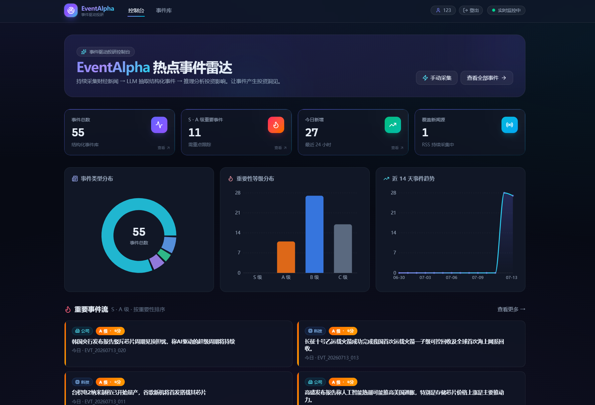
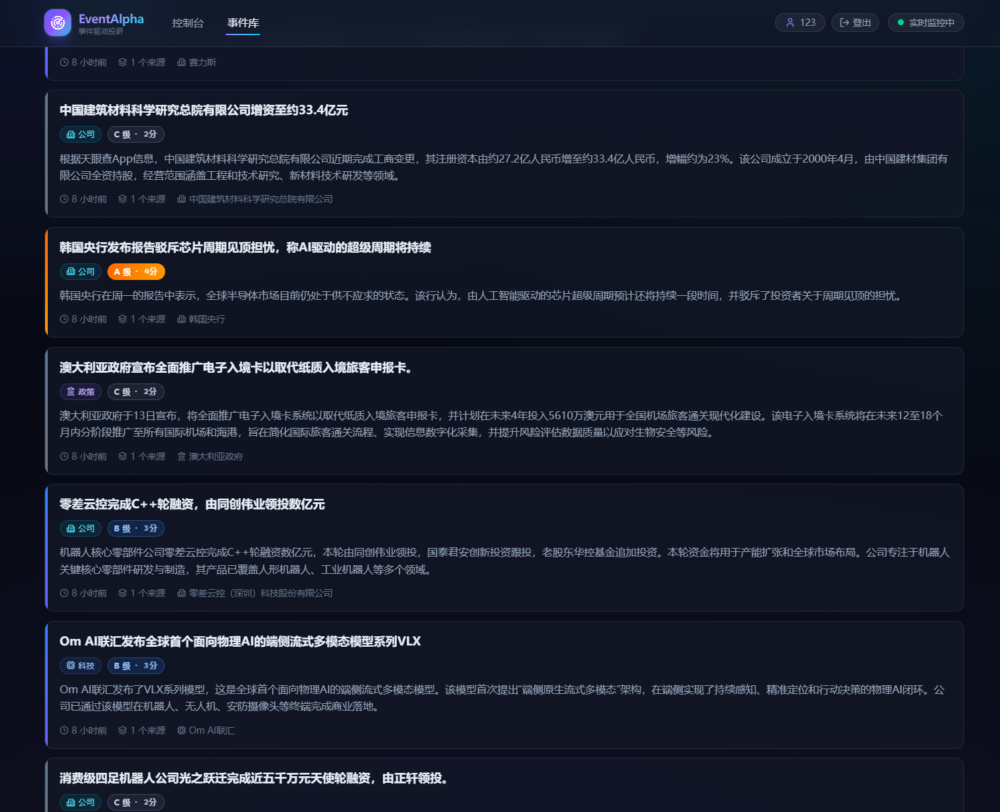
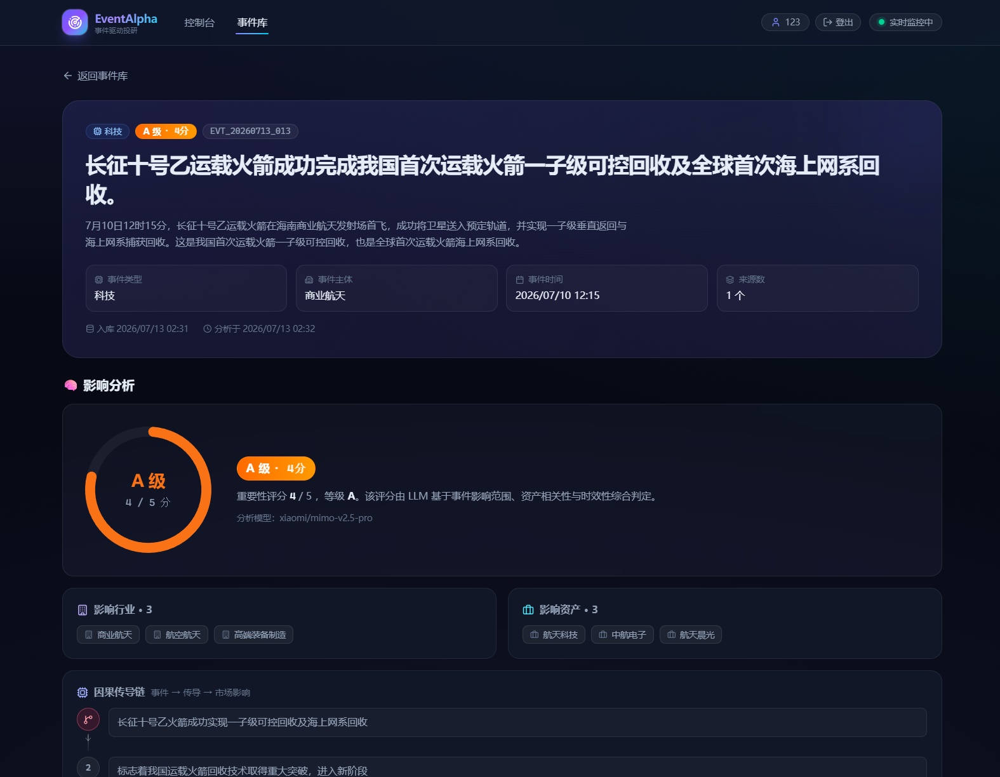

# EventAlpha

> 热点事件驱动投资研究 MVP —— 自动抓取财经新闻,用大模型把新闻结构化为「事件」并做投资影响分析,通过 Web 控制台和 API 暴露给用户。

核心价值:把「人看新闻 → 人判断影响」的流程,自动化为「系统采集 → 系统抽取 → 系统分析 → 人查阅可解释的事件卡片」。

---

## ✨ 系统特性与功能

### 📡 自动化新闻采集

- 定时抓取 5 个中文财经 RSS 源(36kr、华尔街见闻、财新、新浪财经、东方财富)。
- 内容哈希(SHA-256)去重,避免同一新闻重复入库。
- 每 30 分钟自动跑完整流水线(采集 → 抽取 → 分析),也可手动触发。

### ⚙️ 事件抽取与去重

- LLM 把原始新闻结构化为:事件标题、类型、主体、时间、摘要。
- 字符 bigram 覆盖度算法合并相似事件(同一事件不同来源/详略),避免重复卡片。
- `extract_status` 状态机永久跳过噪声与失败新闻,节省 LLM 调用。

### 🧠 投资影响分析

- 并发 LLM 分析每个事件,输出:重要性评分(S/A/B/C)、影响行业、影响资产、因果传导链、正负因素、风险提示。
- 429 限流指数退避重试,单事件失败不中断整批。

### 🖥️ Dashboard 控制台

暗色金融终端风格的可视化界面:



- KPI 卡片(事件总数、S+A 级、今日新增、覆盖新闻源)
- 事件类型分布、重要性等级分布、14 天趋势图表
- S·A 级重要事件流

### 📋 事件库与详情

支持按类型、重要性、时间范围筛选与分页浏览:



事件详情页展示完整的影响分析,含因果传导链、正负面对比、来源列表:



### 🔐 用户注册与登录

- 用户名 + 密码注册/登录,bcrypt 密码哈希 + JWT httpOnly Cookie。
- 登录后在导航栏显示用户名与登出按钮。
- 现有查询 API 保持开放,仅 `/api/auth/me` 需登录。

### 🔌 REST API

事件列表/详情/卡片、Dashboard 聚合统计、手动触发采集/抽取/分析、用户鉴权,全部 REST 接口开放。

---

## 🚀 快速开始

### 环境要求

- Python ≥ 3.12、Node.js(支持 Next.js 15)、[uv](https://github.com/astral-sh/uv)

### 后端

```bash
cd backend
uv pip install -e ".[dev]" --python .venv/Scripts/python.exe
cp .env_example .env   # 填入 LLM API Key 和 SECRET_KEY
.venv/Scripts/python.exe -m alembic upgrade head
.venv/Scripts/python.exe -m uvicorn app.main:app --reload   # localhost:8000
```

生成 `SECRET_KEY`:`python -c "import secrets;print(secrets.token_urlsafe(48))"`

### 前端

```bash
cd frontend
npm install
npm run dev    # http://localhost:3000,默认代理到 localhost:8000
```

打开 http://localhost:3000 看到 Dashboard;`/register` 注册,`/login` 登录。

### LLM 提供方

默认小米 MiMo(`config/llm.yaml`),在 `.env` 填对应 Key 即可切换:`XIAOMI_API_KEY` / `DEEPSEEK_API_KEY` / `DASHSCOPE_API_KEY` / `OPENAI_API_KEY`。

---

## 🧪 测试

```bash
cd backend
.venv/Scripts/python.exe -m pytest          # 57 用例
.venv/Scripts/python.exe -m ruff check .    # Lint
```

```bash
cd frontend
npx tsc --noEmit    # 类型检查
npm run lint        # ESLint
```

---

## 🏗️ 架构与技术栈

四层流水线,上层产物表是下层输入:

```
📡 采集层 collectors/    RSS×5 → 去重 → raw_news
        ↓
⚙️ 处理层 processors/    raw_news → LLM 抽取 → bigram 合并 → events/event_sources
        ↓
🧠 分析层 analysis/      events → 并发 LLM → event_analysis(1:1)
        ↓
🖥️ 服务层 api/v1/ + frontend/  事件/统计/鉴权 API + Next.js 前端
```

定时任务 `scheduler.py` 每 30 分钟串行跑完整流水线。

| 层 | 技术 |
|---|---|
| 后端 | Python 3.12 · FastAPI(同步)· SQLAlchemy 2.0 · Alembic · Pydantic v2 |
| 数据库 | SQLite(单文件,可平滑迁 PostgreSQL) |
| LLM | LangChain 1.x,支持 DeepSeek / 通义千问 / OpenAI / 小米 MiMo |
| 鉴权 | bcrypt + PyJWT(HS256)+ httpOnly Cookie |
| 前端 | Next.js 15 · React 19 · TypeScript · Tailwind v4 · recharts · framer-motion |

5 张表:`raw_news` / `events` / `event_sources` / `event_analysis` / `users`。

完整的架构图(含数据流、ER 图、API 路由、鉴权链路)见 [docs/系统架构图.md](docs/系统架构图.md)。

---

## 🔌 API 一览

| 方法 | 路径 | 说明 | 鉴权 |
|---|---|---|---|
| GET | `/health` | 健康检查 | 开放 |
| GET | `/api/events` | 事件列表(筛选 + 分页) | 开放 |
| GET | `/api/events/{id}` | 事件详情(含来源 + 分析) | 开放 |
| GET | `/api/events/{id}/card` | 事件卡片 | 开放 |
| GET | `/api/stats` | Dashboard 聚合统计 | 开放 |
| POST | `/api/jobs/collect` `extract` `analyze` | 手动触发流水线 | 开放 |
| POST | `/api/auth/register` `login` `logout` | 注册/登录/登出 | 开放 |
| GET | `/api/auth/me` | 当前登录用户 | 需登录 |

手动触发:`curl -X POST http://localhost:8000/api/jobs/collect`

---

## 📂 目录结构

```
EventAlpha/
├── backend/
│   ├── app/{collectors,processors,analysis,services/llm,api/v1,models,schemas,core}
│   ├── config/          YAML 配置 + prompts/ 模板
│   ├── alembic/         数据库迁移
│   └── tests/           unit + integration
├── frontend/
│   ├── app/             Dashboard + events + login/register
│   ├── components/      ui/ + charts/ + 顶层组件
│   └── lib/             api.ts / types.ts / constants.tsx / utils.ts
├── images/              系统截图
└── docs/
    ├── 系统功能说明.md
    └── 系统架构图.md
```

---

## 📖 更多文档

- [docs/系统功能说明.md](docs/系统功能说明.md) —— 18 节完整功能说明
- [docs/系统架构图.md](docs/系统架构图.md) —— ASCII + Mermaid 架构图
- [CLAUDE.md](CLAUDE.md) —— 代码库开发指引

---

## ⚠️ 合规提示

EventAlpha 仅供事件研究与学习,**不构成任何投资建议**。系统输出的事件分析由 LLM 生成,可能存在偏差或错误,请独立判断。
