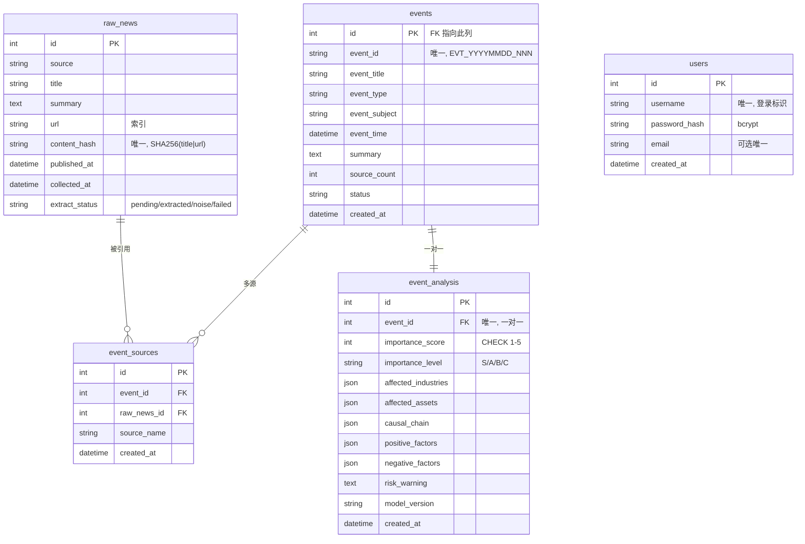
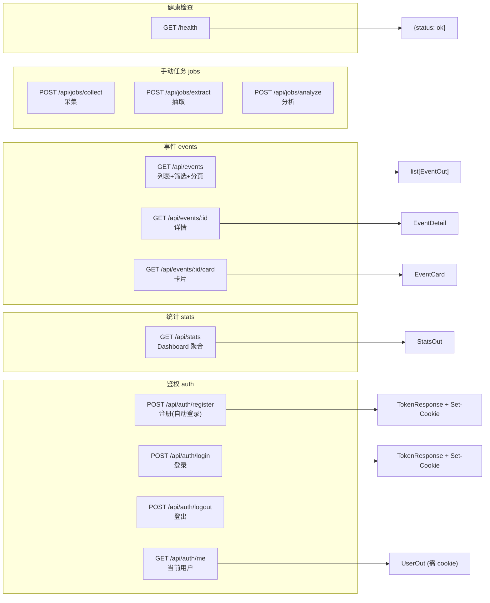
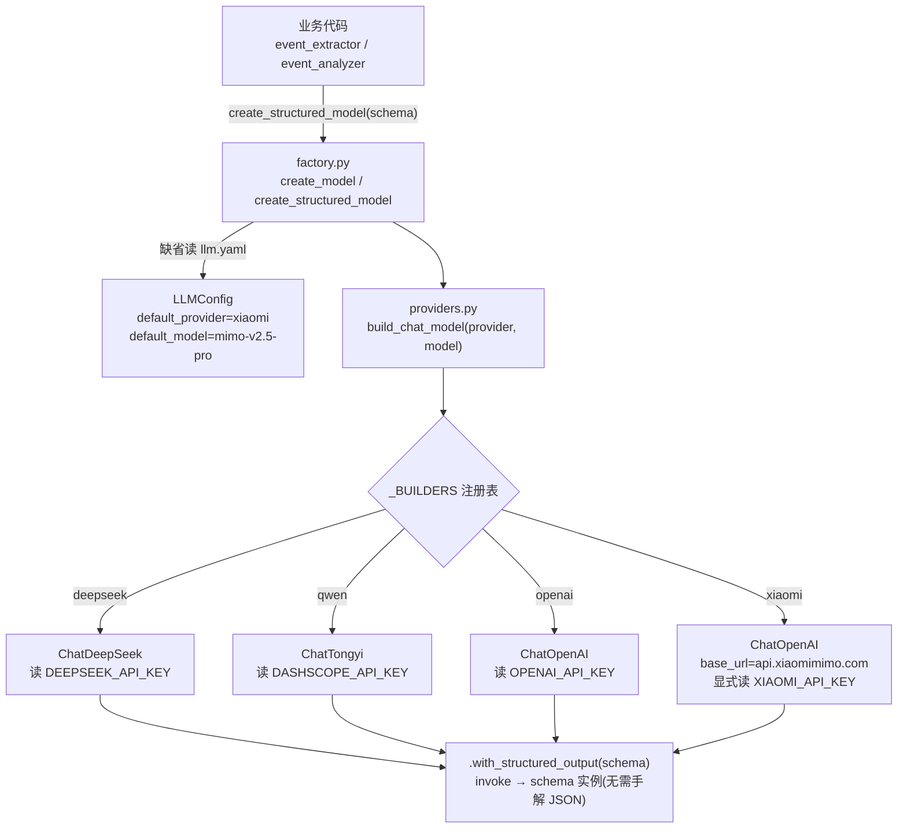

# EventAlpha 系统架构图

> 本文件用文本 + Mermaid 描述 EventAlpha 的整体架构、四层流水线、数据流与鉴权链路。
> 配合 [系统功能说明.md](./系统功能说明.md) 阅读。

## 1. 总体架构

```text
┌─────────────────────────────────────────────────────────────────────┐
│                         浏览器 (localhost:3000)                       │
│  Next.js 15 App Router · React 19 · Tailwind v4 · 强制暗色            │
│                                                                       │
│   Server Component 直连后端        Client Component 走同源 /api 代理    │
│   (Dashboard/事件列表/详情)         (SiteHeader 鉴权 / 表单 / 采集按钮)  │
└──────────────────────────────┬──────────────────────────────────────┘
                               │ HTTP
                 ┌─────────────┴─────────────┐
                 │  next.config.mjs rewrites  │  /api/:path* → 后端
                 └─────────────┬─────────────┘
                               │
┌──────────────────────────────▼──────────────────────────────────────┐
│                  FastAPI 后端 (localhost:8000)                        │
│  app/main.py · lifespan 建表 + 启停定时任务 · CORS 允许 3000           │
│                                                                       │
│  ┌───────────── API 层 app/api/v1/ ─────────────┐                     │
│  │  events   stats   collect   auth(+deps)      │                     │
│  │  GET 列表/详情/卡片  聚合统计  采集/抽取/分析  │                     │
│  │                              注册/登录/登出/me│                     │
│  └──────────────────────┬───────────────────────┘                     │
│                         │ Depends(get_db) / Depends(get_current_user) │
│  ┌──────────────────────▼───────────────────────────────────────────┐ │
│  │                    四层流水线 (业务层)                              │ │
│  │                                                                    │ │
│  │  📡 采集层 collectors/      →  raw_news                          │ │
│  │       collect_all (RSS×5 源)     content_hash 去重, extract_status │ │
│  │            │                                                       │ │
│  │  ⚙️ 处理层 processors/      →  events + event_sources           │ │
│  │       process_all                LLM 抽取 + bigram 合并(阈值0.6)   │ │
│  │            │                                                       │ │
│  │  🧠 分析层 analysis/        →  event_analysis (1:1)             │ │
│  │       analyze_all                并发 LLM 分析 + 429 指数退避      │ │
│  │            │                                                       │ │
│  │  🛠️ LLM 服务 services/llm/  四方工厂 (deepseek/qwen/openai/xiaomi)│ │
│  └──────────────────────┬───────────────────────────────────────────┘ │
│                         │ SQLAlchemy 2.0 (同步)                       │
│  ┌──────────────────────▼───────────────────────────────────────────┐ │
│  │  app/core/  database(SQLite+PRAGMA FK)  security(bcrypt+JWT)     │ │
│  │  utils/config_handler  YAML→dataclass + .env 注入                  │ │
│  └────────────────────────────────────────────────────────────────────┘ │
└──────────────────────────────┬──────────────────────────────────────┘
                               │
                 ┌─────────────▼─────────────┐
                 │   SQLite  eventalpha.db    │  5 张表
                 │   raw_news / events /       │
                 │   event_sources /           │
                 │   event_analysis / users    │
                 └────────────────────────────┘
```

## 2. 四层流水线数据流

```text
        RSS 源 (36kr / 华尔街见闻 / 财新 / 新浪财经 / 东方财富)
                              │
                              ▼
        ┌─────────────────────────────────────────┐
        │  📡 采集层  collectors/rss_collector.py   │
        │  collect_all(db) → list[CollectStats]    │
        │                                          │
        │  · httpx 拉 feed + feedparser 解析        │
        │  · content_hash = SHA256(title|url) 去重 │
        │  · summary 去 HTML 标签截断 2000 字       │
        │  · 新行 extract_status='pending'         │
        └────────────────────┬────────────────────┘
                             │ 写入
                             ▼
                      ╔════════════╗
                      ║  raw_news  ║  (原始新闻)
                      ╚══════╤═════╝
                             │ _load_unprocessed_news (只取 pending)
                             ▼
        ┌─────────────────────────────────────────┐
        │  ⚙️ 处理层  processors/                   │
        │  process_all(db) → ExtractResult         │
        │                                          │
        │  event_extractor.py  单条→LLM→ExtractedEvent
        │  event_dedup.py      bigram 覆盖度≥0.6 合并
        │  event_processor.py  编排 + 状态机流转    │
        │                                          │
        │  状态机:                                  │
        │    pending ─成功(非other)─→ extracted     │
        │    pending ─LLM 判 other──→ noise  (永久跳过)
        │    pending ─LLM None/异常─→ failed (永久跳过)
        └────────────────────┬────────────────────┘
                             │ 写入
                ┌────────────┴─────────────┐
                ▼                          ▼
          ╔═════════╗               ╔══════════════╗
          ║ events  ║◀──────────────║ event_sources ║ (多源关联)
          ╚═════╤═══╝  (event_id)   ╚══════╤═══════╝
                │                            │ FK→raw_news
                │ NOT IN event_analysis      │
                ▼                            │
        ┌─────────────────────────────────────────┐
        │  🧠 分析层  analysis/                     │
        │  analyze_all(db) → AnalyzeResult        │
        │                                          │
        │  event_analyzer.py   单条→LLM→AnalyzedEvent
        │    · 429 限流指数退避 (2s→4s→8s, 最多3次) │
        │    · 其他异常返回 None(隔离不中断)        │
        │  analysis_processor.py                   │
        │    · ThreadPoolExecutor 并发(_MAX_WORKERS)│
        │    · 结果先收集再统一 commit              │
        │    · model_version 记 provider/model     │
        └────────────────────┬────────────────────┘
                             │ 写入 (FK 上 unique 强制 1:1)
                             ▼
                   ╔════════════════╗
                   ║ event_analysis ║  (重要性/影响/因果链/风险)
                   ╚════════════════╝

  定时驱动: scheduler.py  每 30 分钟串行跑 collect→extract→analyze
            (单步失败不阻塞后续, 在 main.py lifespan 启停)
```

## 3. 数据库 ER 关系(Mermaid)



> 关键约定:外键一律指向整型 `id`(非展示码 `event_id`);`event_analysis` 在 FK 上加 UNIQUE 约束强制一对一;JSON 字段用可移植 `JSON` 类型(SQLite 存 TEXT、PG 存 json)。

## 4. API 路由总览(Mermaid)



> 鉴权范围:仅 `/api/auth/me` 需登录(cookie)。事件/统计/采集 API 保持开放。

## 5. 鉴权链路

```text
┌─────────────┐   POST /api/auth/register|login
│  登录/注册页  │ ─────────────────────────────┐
│ (Client)    │                              │
└─────────────┘                              ▼
                                  ┌─────────────────────┐
                                  │  auth.py 路由        │
                                  │  verify_password     │
                                  │  create_access_token │  HS256 JWT(sub=username, exp=24h)
                                  │  response.set_cookie │  ea_auth_token; HttpOnly; SameSite=Lax; Max-Age=86400
                                  └──────────┬──────────┘
                                             │ Set-Cookie
                                             ▼
                                  ┌─────────────────────┐
                                  │  浏览器 cookie jar    │  httpOnly: JS 不可读 (防 XSS)
                                  │  ea_auth_token       │
                                  └──────────┬──────────┘
                                             │ 后续请求自动携带
                             ┌───────────────┴───────────────┐
                             ▼                               ▼
                ┌──────────────────────┐      ┌────────────────────────┐
                │ GET /api/auth/me     │      │ Server Component       │
                │ (浏览器自动带 cookie) │      │ fetchMeServer()        │
                │  → get_current_user  │      │  cookies() 读 token    │
                │  → decode_access_token│      │  手动设 Cookie 头转发  │
                │  → 查 User 表        │      │  → 后端 /auth/me       │
                └──────────┬───────────┘      └────────────────────────┘
                           │
                           ▼
                    ┌──────────────┐
                    │  users 表     │  bcrypt 哈希校验
                    └──────────────┘

  前端登录态同步: login/register/logout 成功后
    window.dispatchEvent(new Event("auth-change"))
    → SiteHeader 监听该事件, 重调 fetchMe() 刷新导航栏
```

## 6. LLM 调用工厂



> 原则:所有 LLM 调用走工厂,不在业务代码直接实例化;结构化输出由底层 SDK 完成,不自行解析 JSON;Prompt 模板外置于 `config/prompts/*.txt`,`lru_cache` 启动读一次。

## 7. 配置与部署拓扑

```text
backend/  (CWD 必须在此, 相对路径依赖)
├── config/                非密钥 YAML (可入库)
│   ├── llm.yaml           LLM 默认 provider/model
│   ├── database.yaml      sqlite:///./eventalpha.db
│   ├── logging.yaml       日志级别/轮转
│   ├── security.yaml      JWT/Cookie 参数 (SECRET_KEY 走 .env)
│   └── prompts/           event_extraction.txt / event_analysis.txt
├── .env                   密钥 (gitignore): *_API_KEY + SECRET_KEY
├── .env_example           密钥模板
├── eventalpha.db          SQLite 生产库 (CWD 相对生成)
└── logs/app.log           RotatingFileHandler 10MB×5

frontend/
├── .env.local             BACKEND_URL=http://localhost:8000
├── next.config.mjs        rewrites /api/:path* → 后端
└── lib/api.ts             API_BASE 双模式: Server 用 BACKEND_URL, Client 走 /api 代理

运行:
  后端  cd backend && .venv/Scripts/python.exe -m uvicorn app.main:app --reload
  前端  cd frontend && npm run dev
  迁移  cd backend && .venv/Scripts/python.exe -m alembic upgrade head
  测试  cd backend && .venv/Scripts/python.exe -m pytest
```

> 硬性约定:所有后端命令从 `backend/` 运行(配置/数据库/Prompt 均相对 CWD);导入统一用 `from app.xxx` / `from utils.xxx` 顶层风格;时间统一 UTC naive datetime。
